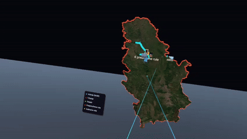

# Moja Srbija VR

**Imerzivna vizuelizacija ličnih Strava aktivnosti na 3D terenu Srbije.**
Standalone VR aplikacija za Meta Quest 2 — projekat iz predmeta *Virtuelna stvarnost*
(doktorske akademske studije).

Maketa Srbije sa realnim reljefom i satelitskim snimcima lebdi pred korisnikom;
preko nje svetle sve GPS putanje iz lične Strava arhive (109 aktivnosti, ~2.400 km).
Rute se biraju laserom ili dodirom, slične putanje se automatski grupišu,
fotografije sa treninga lebde iznad mesta snimanja, a svaka ruta može ponovo
da se „provoza" kroz teren brzinom iz stvarnog zapisa.

> Detaljan opis cilja, realizacije i rezultata: [IZVESTAJ.md](IZVESTAJ.md)

## Video prikaz

*Klik na pregled otvara pun snimak gameplay-a (2:52) - dobrodoslica, mapa,
selekcija ruta, galerija i voznja.*

## Struktura repozitorijuma

| Putanja | Sadržaj |
|---|---|
| `MojaSrbijaVR/` | Unity 6 projekat — VR aplikacija (URP, OpenXR, XRI 3) |
| `MojaSrbijaVR/Assets/Scripts/` | Runtime: selekcija, grupisanje, replay, UI, foto-pinovi… |
| `MojaSrbijaVR/Assets/Editor/` | „Pekara" makete (DEM + satelit → mesh + teksture) i setup alati |
| `strava-vr/` | Python pipeline (Strava OAuth → GeoJSON) + web 3D prototip (MapLibre) |

## Pokretanje

**Podaci (jednokratno):** u `strava-vr/` kopirati `.env.example` → `.env` sa
sopstvenim Strava API kredencijalima, pa `python strava_fetch.py`.
Zatim u Unity-ju: meni **MojaSrbija → 8** (peče maketu iz javnih izvora:
AWS Terrarium DEM + Esri World Imagery) i **MojaSrbija → 9** (interakcije).

**VR:** Play mode preko Virtual Desktop / Quest Link, ili **MojaSrbija → 10**
za standalone APK (IL2CPP, ARM64) koji se instalira na Quest.

## Tehnologije

Unity 6 · OpenXR · XR Interaction Toolkit 3 · Python 3 (bez zavisnosti) ·
Strava API v3 · AWS Terrarium DEM · Esri World Imagery · OpenStreetMap · MapLibre GL

## Napomena o podacima

Repozitorijum sadrži lične GPS podatke autora (`StreamingAssets/`), pa je privatan.
API ključevi i tokeni (`.env`, `token.json`, keystore) su van verzione kontrole.
